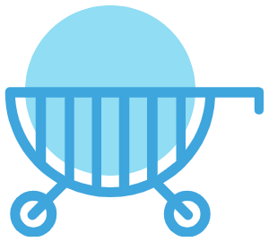

  

<h3 align="center">shopping-web-app</h3>

---

 This is a fronend Web application for shopping-cart created using react and react-router
      

## 📝 Table of Contents

- [About](#about)
- [Built Using](#built_using)
- [Contributing](#contributing)
- [Authors](#authors)
- [Acknowledgments](#acknowledgement)

## 🧐 About 

This is a basic shopping web application in which we can add products to cart get total amount and total items

## 🚧 Contribution

Feel Free to Contribute

## ⛏️ Built Using 

- [HTML](https://www.google.com/search?q=html) - Markup Language
- [CSS](https://www.google.com/search?q=css) - Style Language
- [Javascript](https://www.google.com/search?q=javascript) - Logic Language
- [React](https://reactjs.org/) - Frontend Framework
- [React Router](https://www.npmjs.com/package/react-router-dom) - Routing FrameWork

## ✍️ Authors 

- [@vinaykanase](https://github.com/VinayKanase)

## 🎉 Acknowledgements 

- Inspiration - [odin projects](https://www.theodinproject.com/)
- References - [odin projects](https://www.theodinproject.com/)
